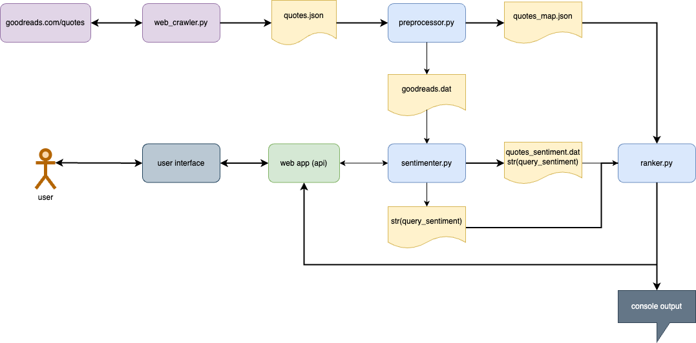

# Quote Finder

## Authors

- Team Name | **Lunar-Tsai**
    - Manuel Suarez Lunar | [manuel6@illinois.edu](manuel6@illinois.edu)
    - Wei-Lun (Will) Tsai | [wltsai2@illinois.edu](wltsai2@illinois.edu) --> team captain 

- University of Illinois Urbana-Champaign | Fall 2023
- CS 410: Text Information Systems | ChengXiang Zhai

- Code Repo | [github.com/.../quote-finder](https://github.com/willtsai/quote-finder)

## Overview

Quote Finder is a unique search engine / text retrieval tool specifically tailored for literature and quote enthusiasts. Users input a particular sentiment or emotion and then Quote Finder searches the catalog of famous quotes available on [goodreads.com/quotes](https://www.goodreads.com/quotes) to return a ranked list of quotes and respective authors resonating with the user's specified sentiment. 

## Architecture

The architecture consists of three main backend components: (1) web crawler, (2) preprocessor, (3) searcher, (4) web application, and (5) user interface. The web crawler collects raw quotes data from the Goodreads quotes website, which is then processed by the preprocessor to extract, normalize, and tokenize the quotes along with their corresponding metadata. The searcher parses the user sentiment input, builds an inverted index, then searches against the index to return a set of ranked quotes based on relevance to a given query. A web application (API) is built on top of these components, which is then fronted by a user interface for users to interact with the application.



*Figure 1: Overall architecture diagram for Quote Finder*

### Web Crawler

The web crawler is implemented using the Scrapy Python library in `web_crawler.py`. It crawls the Goodreads quotes website and extracts quotes, authors, and tags for each quote, and then follows the "next" link to crawl subsequent pages. The quotes data is output to a JSON file that is picked up by the preprocessor.

### Preprocessor

The preprocessor is implemented in Python, and the code can be found in the `preprocessor.py` file. It takes a raw quotes data file (in JSON format) as input, and outputs two data files: (1) a `quotes.dat` containing the processed quotes data, and (2) a `quotes_map.json` metadata file containing the metadata for each quote. The `quotes.dat` file is used by the searcher to build the inverted index, while the `quotes_map.json` file is used to display the metadata for each quote in the user interface.

### Searcher

The searcher is implemented in Python, and the code can be found in the `searcher.py` file. This is the core component of the Quote Finder application with functions to perform the key processes of the application:
1. `sentiment()` function to parse the user input into a broader set of opinions leveraging the [`nltk.corpus.sentiwordnet`](https://www.nltk.org/howto/sentiwordnet.html) APIs and dataset from the NTLK Python library.
2. `build_index()` to build the inverted index, `load_ranker()` to load a ranker, `load_query()` to load a query, and `run_query()` to search the index with a given query which returns a ranked list of quotes as the result.
3. `results_to_string()` function to convert the results into a string format that can be displayed in the user interface.

### Web Application

The web application is implemented using the Flask Python library in `webapp.py`. It exposes a set of API endpoints that are called by the user interface to invoke the searcher, and returns the results to the user interface.

### User Interface

The user interface is implemented using HTML templates in the `templates` directory. It consists of an `index.html` home page with a search bar for the user to input a sentiment, and an `output.html` page that displays the ranked list of quotes returned by the searcher. These UI pages are rendered by the `webapp.py` Flask web application.

## Setup Instructions

1. If you are running this on an Apple Silicon Mac (e.g. M1, M2 chips), adjust your Conda config:

    ```bash
    conda config --env --set subdir osx-64
    ```

2. Create a Python 3.5 Conda environment:

    ```bash
    conda create -n py35
    ```

3. Setup your Conda command line prompt:

    ```bash
    export CONDA_DIR=conda info | grep -i 'base environment'
    source $CONDA_DIR/etc/profile.d/conda.sh
    ```

4. Create and activate a Flask environment for the web application:

    ```bash
    python -m venv .venv
    . .venv/bin/activate
    ```

5. Install and activate the Python 3.5 Conda environment:

    ```bash
    conda activate py35
    conda install python=3.5
    ```

6. Install the project dependencies:

    ```bash
    pip install -r requirements.txt
    ```

7. Run the web crawler and preprocessor to prepare the quotes data:

    ```bash
    python web_crawler.py
    python preprocessor.py
    ```

8. Run the web app:

    ```bash
    python webapp.py
    ```

9. Navigate to [http://127.0.0.1:5000/](http://127.0.0.1:5000/) in a web browser to interact with the Quote Finder web application.